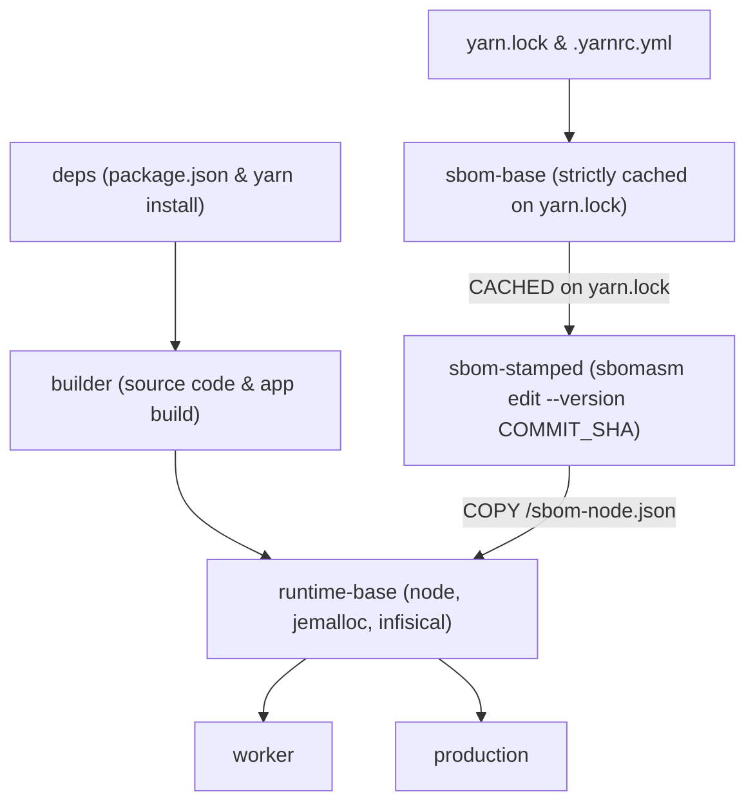

# RHL Docker SBOM & Build Caching Helper

This skill provides utilities, validation protocols, and architecture guidance for verifying multi-stage Docker builds and Software Bill of Materials (SBOM) generation across Empo Health / RHL workspaces (such as `workspaces/backend-api`).

---

## Background & SBOM Architecture

In Empo Health backend and frontend Docker builds, full dependency scans with `cyclonedx-yarn` and `sbomasm` incur substantial overhead (30–60s) if rebuilt on every commit.

To achieve fast builds while retaining fully-formed, stamped SBOMs for every PR and release build, Dockerfiles employ an isolated two-stage SBOM pipeline:



1. **`sbom-base`**:
   - Derives directly from base `node:*-slim` (isolated from `deps` and `package.json`).
   - Copies **only** `yarn.lock` and `.yarnrc.yml`.
   - Generates minimal workspace manifests strictly from `yarn.lock` so that non-dependency edits to `package.json` (such as new scripts or formatting) **never** bust the SBOM cache.
   - Runs `cyclonedx-yarn --mc-type application --production` and stamps document-level metadata (`Document`, `--name`, `--supplier`, `--repository`).
   - Enables 100% layer cache hits across commits as long as dependencies in `yarn.lock` remain unchanged.

2. **`sbom-stamped`**:
   - Derives from `sbom-base`.
   - Takes `ARG COMMIT_SHA`.
   - Stamps the primary component version in **~0.2–0.3s** using `sbomasm edit --subject primary-component ... --version "${COMMIT_SHA}"`.

3. **`runtime-base`**:
   - Copies `/sbom-node.json` from `sbom-stamped`.
   - Serves as the base for `production` and `worker` stages.

---

## Bundled Verification Script

The skill provides an automated verification script under `scripts/`:

### `verify-docker-sbom-caching.sh`

Runs a two-pass build test to ensure:
- Pass 1 builds a baseline image with an initial commit SHA (`--sha1`).
- Pass 2 rebuilds with a new commit SHA (`--sha2`) and verifies that `[sbom-base]` hits the BuildKit layer cache.
- Inspects `/sbom-node.json` in the resulting container to confirm `.metadata.component.version` matches `--sha2`.
- Cleans up test container images automatically.

#### Usage Examples

```bash
# Verify backend-api production stage (default)
~/.gemini/config/skills/rhl-docker-sbom/scripts/verify-docker-sbom-caching.sh

# Verify backend-api worker stage
~/.gemini/config/skills/rhl-docker-sbom/scripts/verify-docker-sbom-caching.sh -t worker

# Test with custom SHAs
~/.gemini/config/skills/rhl-docker-sbom/scripts/verify-docker-sbom-caching.sh \
  --sha1 abc1234 \
  --sha2 def5678

# Keep generated test images for manual examination
~/.gemini/config/skills/rhl-docker-sbom/scripts/verify-docker-sbom-caching.sh --no-cleanup
```

---

## Manual Verification Protocol

If verifying manually without the script:

### 1. Build and Test Layer Caching

```bash
# 1. Baseline build
docker build --platform linux/amd64 -f workspaces/backend-api/Dockerfile \
  --build-arg COMMIT_SHA=sha-test-1 -t test-backend:run1 .

# 2. Second build with new SHA (observe sbom-base CACHED)
docker build --platform linux/amd64 -f workspaces/backend-api/Dockerfile \
  --build-arg COMMIT_SHA=sha-test-2 -t test-backend:run2 .
```

Verify that `[sbom-base]` output shows `CACHED` and `[sbom-stamped]` runs in < 1 second.

### 2. Inspect Container SBOM Metadata

Verify that the container's `/sbom-node.json` contains valid JSON and the updated `COMMIT_SHA`:

```bash
docker run --rm --platform linux/amd64 test-backend:run2 cat /sbom-node.json | jq '.metadata.component'
```

Expected output structure:
```json
{
  "bom-ref": "empo-backend-api@workspace:workspaces/backend-api",
  "type": "application",
  "supplier": {
    "name": "Empo Health, Inc.",
    "url": ["https://empohealth.com"]
  },
  "name": "Empo Remote Health Link Backend API",
  "version": "sha-test-2"
}
```

### 3. Cleanup Test Images

```bash
docker rmi test-backend:run1 test-backend:run2
```
